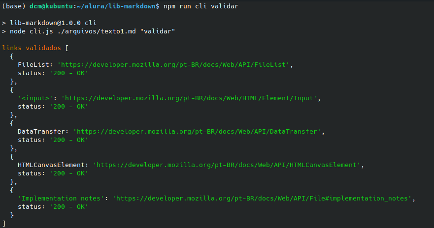
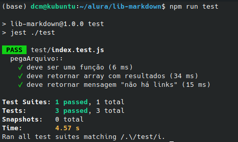

# NodeJS: Criando sua biblioteca

Nesse script foi aprendido como verificar e validar links, de acordo com o código de status HTTP, e também:

✔️ Como importar e utilizar código de repositórios de código aberto

✔️ Promessas e como trabalhar com código asíncrono em NodeJS

✔️ Utilização de bibliotecas do NodeJS para fazer requisições HTTP e manejar respostas

✔️ Testes de unidade com Jest

`npm run cli validar`
`npm run teste`

Resultado:

  

Node Jest Test:

  
